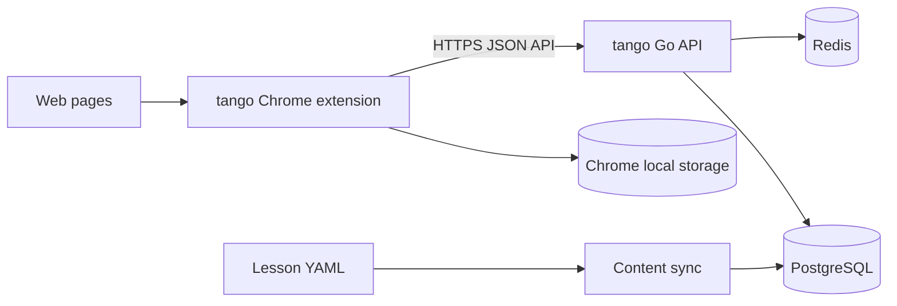
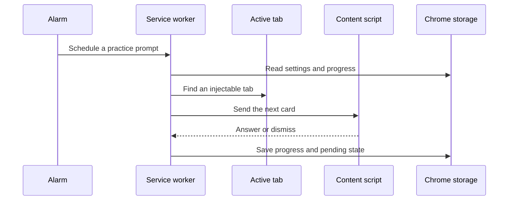
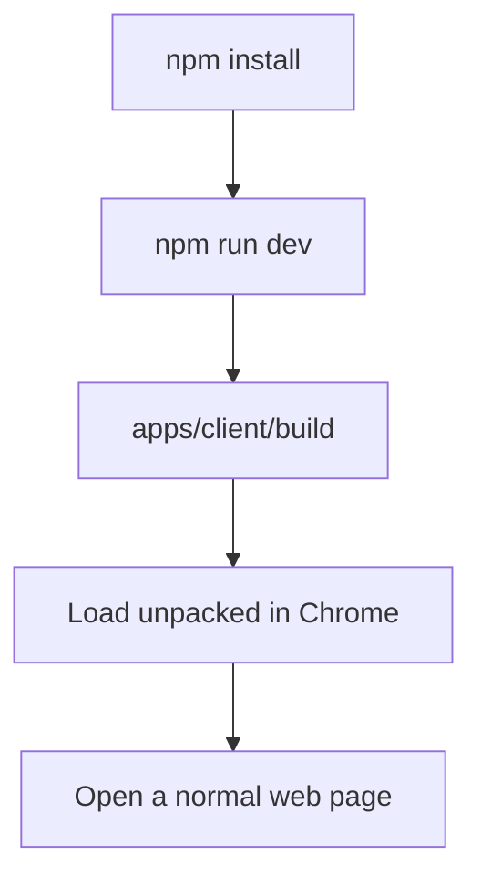

# tango

Learn Japanese while you browse.

[](https://chromewebstore.google.com/)
[](https://render.com/)
[](https://neon.tech/)
[](https://newrelic.com/)
[](https://www.postgresql.org/)

tango is a small learning platform made of two parts:

- a Chrome extension that turns browsing into short, repeated practice sessions;
- a Go API that provides authentication, progress, settings, and lesson management.

The extension works locally with bundled lessons and local browser storage. The API is the foundation for account-based and server-backed features.

## Production backend

The production API runs on Render, uses Neon-hosted PostgreSQL, and sends application logs and observability data to New Relic.

## At a glance

| Area | Choice |
| --- | --- |
| Client | TypeScript, React 18, Vite, Chrome Manifest V3 |
| API | Go, Echo, JWT |
| Data | PostgreSQL and Redis |
| Local orchestration | Docker Compose and Taskfile |
| Current state | MVP |

## How it fits together



### Runtime flow



## What users get

- Introduction, concept, and test cards.
- Configurable practice intervals and quiet hours.
- Pause/resume and **Show card now** practice.
- A pending card that survives tab changes and restricted pages.
- Mastery tracking and lesson unlocking.
- Popup, side panel, and Options page controls.
- Google sign-in integration and a JWT-protected API path.

## Repository map

```text
.
├── apps/
│   ├── client/                 Chrome extension
│   │   ├── src/background/      Service worker, scheduling, API client
│   │   ├── src/content/         Bundled lessons
│   │   ├── src/contentScript/   Cards injected into web pages
│   │   ├── src/popup/            Toolbar popup
│   │   ├── src/sidepanel/        Progress and controls
│   │   └── src/options/          User settings
│   └── backend/                Go API and content services
│       ├── cmd/                 API and sync entry points
│       ├── content/lessons/     Lesson YAML source
│       ├── internal/handler/    HTTP handlers
│       ├── internal/service/    Application logic
│       ├── internal/database/   Connections and migrations
│       ├── compose.yml          Local PostgreSQL and Redis
│       └── Taskfile.yml         Development commands
└── README.md
```

## Quick start

### Requirements

- Node.js `>=14.18.0` and npm
- Go version compatible with `apps/backend/go.mod`
- Docker and Docker Compose
- Taskfile; Air is used by the backend dev task
- Chrome or another Chromium browser with Manifest V3 support

### 1. Start the API and local services

```bash
cd apps/backend
go mod download
cp .env.sample .env
task dev
```

This starts PostgreSQL and Redis, applies migrations, and runs the Go API with hot reload. Check the API with:

```bash
curl http://localhost:8080/status
```

### 2. Build the extension

In a second terminal:

```bash
cd apps/client
npm install
npm run dev
```

Then open `chrome://extensions`, enable **Developer mode**, choose **Load unpacked**, and select `apps/client/build`.

Open a normal `http://` or `https://` page to try a card. Chrome internal pages, the Web Store, and other restricted pages cannot receive injected cards.



## Common commands

Run backend commands from `apps/backend` and client commands from `apps/client`.

| Command | Result |
| --- | --- |
| `task dev` | Start local services, migrate, and run the API with Air |
| `task test` | Run all Go tests |
| `task build` | Build the API binary as `bin/tango` |
| `task infra:down` | Stop local services and remove their volumes |
| `npm run dev` | Watch and build the extension |
| `npm run build` | Type-check and create a production extension build |
| `npm run zip` | Build and create a versioned Chrome release archive |
| `npm run fmt` | Format client source and documentation |

## API surface

| Method | Route | Auth | Use |
| --- | --- | --- | --- |
| `GET` | `/status` | None | Health check |
| `POST` | `/api/v1/login` | None | Sign in and issue a session/JWT |
| `POST` | `/api/v1/lessons` | JWT | Create lesson content |
| `GET` | `/api/v1/progress` | JWT | Read progress |
| `POST` | `/api/v1/progress/:item_id/attempt` | JWT | Record an attempt |
| `GET` | `/api/v1/settings` | JWT | Read settings |
| `PUT` | `/api/v1/settings` | JWT | Update settings |

The local client API default is `localhost:8080`. Confirm the production API URL, `/api/v1` routing, CORS, OAuth client, and authentication flow before connecting a release build to a deployed API.

## Configuration

Backend configuration is loaded from the `TANGO_*` environment variables. Start with [`apps/backend/.env.sample`](apps/backend/.env.sample).

| Group | Covers |
| --- | --- |
| `TANGO_PRIMARY_*` | Environment name |
| `TANGO_SERVER_*` | Port, timeouts, and CORS |
| `TANGO_DATABASE_*` | PostgreSQL connection and pool settings |
| `TANGO_REDIS_*` | Redis address |
| `TANGO_AUTH_*` | JWT signing configuration |
| `TANGO_INTEGRATION_*` | External services such as Resend |
| `TANGO_OBSERVABILITY_*` | Logs, health checks, and New Relic |

Do not commit `.env` files, OAuth secrets, JWT secrets, API keys, or store credentials.

## Testing

```bash
cd apps/backend && task test
cd apps/client && npm run build
```

For browser behavior, use the manual checklist in [`apps/client/TESTING.md`](apps/client/TESTING.md). It covers scheduling, quiet hours, pending cards, card types, lesson unlocking, progress, and badge behavior.

## Deployment checklist

### API

- Provide PostgreSQL and Redis.
- Apply migrations and synchronize lesson content.
- Set secure `TANGO_*` production configuration.
- Expose the API over HTTPS.
- Configure CORS for the extension origin.
- Monitor `/status`, authentication, database, Redis, and application errors.

The repository does not yet include a production container, cloud-provider configuration, or CI/CD workflow. The Compose file is for local development dependencies.

### Chrome Web Store

```bash
cd apps/client
npm run zip
```

Before uploading the generated archive:

1. Bump the version in `apps/client/package.json`.
2. Test the exact `build/` output in a clean Chrome profile.
3. Verify permissions, icons, OAuth settings, API URL, and HTTPS behavior.
4. Prepare screenshots, support details, a privacy policy, and store disclosures.
5. Upload the ZIP through the [Chrome Web Store Developer Dashboard](https://chrome.google.com/webstore/devconsole) and submit it for review.

Store publishing is manual at present.

## Privacy and permissions

The extension uses `storage`, `alarms`, `tabs`, `scripting`, `activeTab`, `sidePanel`, and `identity` permissions. These support local learning state, scheduling, card injection, controls, and Google sign-in. Review the manifest and privacy disclosures before every release.

## More detail

- [Client guide](apps/client/README.md): extension behavior, permissions, QA, and packaging.
- [Backend guide](apps/backend/README.md): local API setup.
- [Backend API contract](apps/backend/internal/router/contract.md): route and integration notes.

## Contributing

Keep changes scoped to the relevant app. Run the backend tests, client build, and browser checklist when user-facing behavior changes. Update the relevant README or QA checklist alongside workflow changes.

## License

MIT. See [`apps/client/LICENSE`](apps/client/LICENSE).